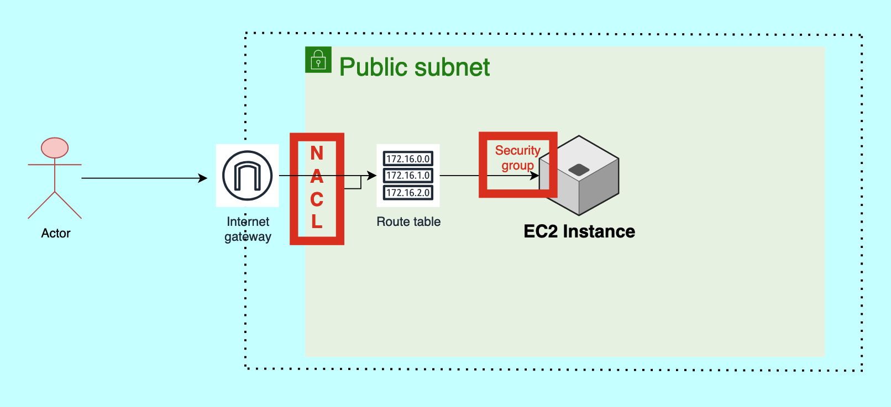

AWS Security using Security Groups and NACL
AWS (Amazon Web Services) provides multiple layers of security to protect resources and data within its cloud infrastructure. Two important components for network security in AWS are Security Groups and Network Access Control Lists (NACLs). Let's explore how each of them works:

# Security Groups: 
Security Groups act as virtual firewalls for Amazon EC2 instances (virtual servers) at the instance level. They control inbound and outbound traffic by allowing or denying specific protocols, ports, and IP addresses.
Each EC2 instance can be associated with one or more security groups, and each security group consists of inbound and outbound rules.
Inbound rules determine the traffic that is allowed to reach the EC2 instance, whereas outbound rules control the traffic leaving the instance.
Security Groups can be configured using IP addresses, CIDR blocks, security group IDs, or DNS names to specify the source or destination of the traffic.
They operate at the instance level and evaluate the rules before allowing traffic to reach the instance.
Security Groups are stateful, meaning that if an inbound rule allows traffic, the corresponding outbound traffic is automatically allowed, and vice versa.
Changes made to security group rules take effect immediately.

# Network Access Control Lists (NACLs):

NACLs are an additional layer of security that operates at the subnet level. They act as stateless traffic filters for inbound and outbound traffic at the subnet boundary.
Unlike Security Groups, NACLs are associated with subnets, and each
subnet can have only one NACL. However, multiple subnets can share the same NACL.
NACLs consist of a numbered list of rules (numbered in ascending order) that are evaluated in order from lowest to highest.
Each rule in the NACL includes a rule number, protocol, rule action (allow or deny), source or destination IP address range, port range, and ICMP (Internet Control Message Protocol) type.
NACL rules can be configured to allow or deny specific types of traffic based on the defined criteria.
They are stateless, which means that if an inbound rule allows traffic, the corresponding outbound traffic must be explicitly allowed using a separate outbound rule.
Changes made to NACL rules may take some time to propagate to all the resources using the associated subnet.

# Steps:

**Project Title**: **Setting Up a Simple Web Server on EC2 in a VPC**

### Steps:

1. **Create a VPC**:
   - Go to AWS VPC Dashboard and create a new **VPC** with **public and private subnets** in one **availability zone**.
   - Set up a **Route Table** for routing between subnets.
   - Configure **Network Access Control Lists (NACLs)** for traffic control.
   - Create a **Security Group** to allow traffic to/from EC2 instances.
   - Attach an **Internet Gateway** to allow EC2 instances in the public subnet to connect to the internet.

   **Note**: You can choose to use the default VPC with the necessary components or manually create them through the VPC wizard in AWS.

2. **Create an EC2 Instance**:
   - Launch a new **EC2 instance** and select the **VPC** you created.
   - Attach the EC2 instance to the **public subnet** for internet access.

3. **Enable Public Subnet**:
   - Ensure the **public subnet** is configured with a route to the **Internet Gateway** for internet access.

4. **SSH into EC2 Instance**:
   - SSH into your **EC2 instance** using the private key and update the system.
   - Install Python and any necessary dependencies, then create and run a **simple Python application** (e.g., using Flask or a basic HTTP server) on port **8000**.

5. **Edit Inbound Rules**:
   - Go to your **Security Group** and modify the **inbound rules** to allow traffic on **port 8000** so you can access the application.

6. **Access the Application**:
   - Open a browser and access the application using the EC2 public IP or Elastic IP and port 8000 (e.g., `http://<EC2_public_ip>:8000`).

7. **Experiment with NACLs and Security Groups**:
   - Test different **NACL** and **Security Group** settings by blocking/allowing traffic to the EC2 instance on various ports and observing the effect on the application.

---
