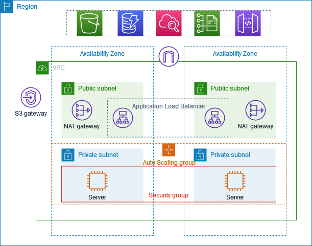

### Project Title: **Creating a Highly Available Web Application Infrastructure on AWS**

This project walks through setting up a Virtual Private Cloud (VPC), Auto Scaling Group (ASG), and Application Load Balancer (ALB) to host a highly available web application. Here's a step-by-step guide:



### Steps to Create a VPC on AWS:

1. **Create a VPC**:
   - Go to the **VPC Dashboard** in the AWS Management Console.
   - Click on **Create VPC**.
   - You can either:
     - Select **"VPC and more"** option, which automatically creates the VPC, subnets, route tables, and internet gateway for you. This simplifies the process, and you don’t have to create each component separately (subnets, routing, internet gateway).
     - Or, if you want more control over each component, choose **"VPC only"** and manually create the resources.
   - For this example, we will manually configure the VPC and resources.

2. **Configure Subnets**:
   - **Public Subnets**:
     - Create 2 public subnets in **different Availability Zones** (e.g., `10.0.0.0/24` in AZ-1 and `10.0.1.0/24` in AZ-2).
     - These subnets will be used for resources like Load Balancers or public-facing instances.
   - **Private Subnets**:
     - Create 2 private subnets in **different Availability Zones** (e.g., `10.0.2.0/24` in AZ-1 and `10.0.3.0/24` in AZ-2).
     - These subnets will be used for internal resources like databases.

3. **Create an Internet Gateway**:
   - In the **VPC Dashboard**, go to **Internet Gateways** and click on **Create Internet Gateway**.
   - Attach the Internet Gateway to the VPC to allow internet access for public subnets.

4. **Create a NAT Gateway**:
   - **Elastic IP**: First, allocate an **Elastic IP** (EIP) to use as the static IP for the NAT Gateway.
   - Create a **NAT Gateway** in each public subnet, assigning one Elastic IP to each NAT Gateway.
   - The NAT Gateway will allow instances in private subnets to access the internet for updates, etc.

5. **Route Tables**:
   - **Public Route Table**: Create a route table for the public subnets that routes internet traffic to the **Internet Gateway**.
   - **Private Route Table**: Create a route table for the private subnets that routes internet-bound traffic to the **NAT Gateway**.

6. **VPC Endpoints**: (Optional) If you need private connections to AWS services without going over the internet, create **VPC endpoints**. However, in this case, the project specifies **no VPC endpoints**.

7. **Security Groups and Network ACLs**: Ensure appropriate security groups and NACLs (Network Access Control Lists) are set up for your instances to control inbound and outbound traffic.

### Key Components:
- **CIDR Block**: `10.0.0.0/16` for the VPC.
- **2 Availability Zones** for redundancy.
- **2 Public Subnets** (`10.0.0.0/24`, `10.0.1.0/24`).
- **2 Private Subnets** (`10.0.2.0/24`, `10.0.3.0/24`).
- **1 NAT Gateway per Availability Zone**.
- **Elastic IP** for each NAT Gateway.

---

### **Step 2: Create an Auto Scaling Group (ASG)**

1. **Launch Template:**
   - **Name and Description:** Give it a clear name, like *WebAppLaunchTemplate*.
   - **Image:** Choose the Ubuntu AMI that is free tier eligible.
   - **Instance Type:** Pick a free tier instance type, such as `t2.micro`.
   - **Key Pair:** Select or create a key pair for SSH access.
   - **Security Group:**
     - **Name and Description:** Name it something like *WebAppSG*.
     - **Inbound Rules:** Allow SSH (`port 22`) for secure access and custom TCP (`port 8000`) for your application.
   - **Template Explanation:** A launch template ensures all instances in the ASG have the same configuration, making it easier to scale consistently.

2. **Auto Scaling Group:**
   - Use the launch template you just created.
   - **VPC and Subnets:** Select your VPC and private subnets.
   - **Desired Capacity and Maximum Size:** Set how many instances you want running (e.g., 2 instances).
   - Once set up, the ASG will automatically manage the number of instances to match your desired settings, scaling up or down as needed.

---

### **Step 3: Create a Bastion Host**
1. **Bastion Host:** Launch an EC2 instance in the public subnet and ensure it has a public IP address.
2. **Security Group:** Configure the security group for the bastion host to allow **SSH (port 22)** access **only from your IP address**.
   - Example rule: `SSH | TCP | 22 | YOUR_IP/32`
3. **PEM File:** Copy the private key file (`.pem`) to your local machine, and from there, upload it to the bastion host for accessing private instances.

   **Command to copy PEM file to the bastion host:**
   ```bash
   scp -i your-key.pem your-key.pem ec2-user@bastion-public-ip:/home/ec2-user/
   ```

# Access Private Instances via Bastion Host**
3. **Login to Bastion Host:** Use SSH to connect to the bastion host.

   **Command to SSH into the bastion host:**
   ```bash
   ssh -i your-key.pem ec2-user@bastion-public-ip
   ```

4. **Access Private Instance:** From the bastion host, use the PEM file to SSH into a private instance.

   **Command to SSH into the private instance from the bastion host:**
   ```bash
   ssh -i /home/ec2-user/your-key.pem ec2-user@private-instance-ip
   ```
---

### **Step 4: Deploy a Simple Application**

1. **Create the Application:**
   First, create a simple web application. For example, here's a basic Python Flask application:

   ```python
   # app.py
   from flask import Flask
   
   app = Flask(__name__)

   @app.route('/')
   def hello():
       return "Project deployed successfully on EC2!"

   if __name__ == "__main__":
       app.run(host='0.0.0.0', port=8000)
   ```

   This simple Flask app will display a success message when accessed.

2. **Run the Application:**
   - SSH into one of your private EC2 instances.
   - Install Flask and run the application on **port 8000**.

   **Commands:**

   ```bash
   sudo apt update
   sudo apt install python3-pip
   pip3 install flask
   python3 app.py
   ```

   This will start the application, and the server will run on **port 8000**.

3. **Test Load Balancing:**
   To test the load balancing, use a **bastion host** to access the application running on the private instance.

   From the bastion host, you can use `curl` or your browser to access the application:

   ```bash
   curl http://<private-instance-ip>:8000
   ```

   If everything is set up correctly, you should see the message **"Project deployed successfully on EC2!"**. This confirms that the application is running, and the load balancer is properly routing traffic.

---

### **Step 5: Create an Application Load Balancer (ALB)**

### **Step 6: Create an Application Load Balancer (ALB)**

1. **Create Load Balancer:**
   - **Name:** Choose a name, e.g., *WebAppALB*.
   - **Scheme:** Select *Internet-facing* to make it accessible from the internet.
   - **IP Address Type:** Choose *IPv4*.
   - **VPC:** Select the appropriate VPC where your instances are located.
   - **Subnets:** Choose the public subnets where the ALB will be deployed.
   - **Security Group:** Allow HTTP traffic on *port 80*.

2. **Create Target Group:**
   - **Type:** Select *Instance* for the target type.
   - **Name:** Choose a name, e.g., *WebAppTG*.
   - **Protocol:** Select *HTTP* and *port 80*.
   - **Instances:** Add the private instances that should receive traffic from the ALB.

3. **Link Target Group to ALB:** Attach the created target group to the ALB, so the ALB knows where to route traffic.

4. **Test the Setup:** Access the application using the ALB’s public DNS name to verify that the traffic is being routed correctly to your instances.

---

### **Explanation:**

- **VPC:** Provides a secure and isolated network environment.
- **Subnets:** Segregate public and private resources.
- **NAT Gateway:** Allows private instances to access the internet.
- **Auto Scaling Group:** Automatically adjusts the number of instances to handle varying loads.
- **Bastion Host:** Acts as a secure gateway to access private instances.
- **Application Load Balancer:** Distributes incoming traffic across multiple instances to ensure high availability and fault tolerance.


# Additional Explanations:**

1. **Elastic IP Explanation:**
   - **Elastic IPs (EIPs)** are static public IP addresses provided by AWS. In this setup, they are attached to the NAT Gateways to ensure that the outbound internet traffic from private instances always originates from the same IP address, which is important for whitelisting in external services.

2. **Why Use a NAT Gateway?**
   - The **NAT Gateway** allows instances in private subnets to access the internet (e.g., for updates or external API calls) while keeping them secure from incoming internet traffic. This ensures a balance between security and functionality.

3. **Why Use Private Subnets for EC2 Instances?**
   - **Private subnets** enhance security by keeping the instances inaccessible from the public internet. Only the **Bastion Host** in the public subnet has a public IP, acting as a secure access point.

4. **Why Create a Bastion Host?**
   - A **Bastion Host** is used to securely manage instances in private subnets. It minimizes the attack surface by limiting direct SSH access to private instances and instead allows controlled access through the bastion.

5. **Health Checks in the Load Balancer:**
   - Health checks in the **Application Load Balancer (ALB)** ensure that traffic is only routed to healthy instances. This is crucial for maintaining high availability because it prevents traffic from being sent to instances that are not functioning properly.

6. **Auto Scaling Group Benefits:**
   - The **Auto Scaling Group (ASG)** ensures that your application can handle varying traffic loads by automatically adjusting the number of instances. If demand increases, more instances are launched; if it decreases, instances are terminated, optimizing cost and performance.

7. **Security Groups Explanation:**
   - **Security Groups** act as virtual firewalls for your instances. They control inbound and outbound traffic to instances. For example, allowing SSH only from specific IPs enhances security by limiting access to trusted sources.

8. **Why Use an Application Load Balancer?**
   - An **Application Load Balancer (ALB)** distributes incoming application traffic across multiple instances, increasing the application's availability and fault tolerance. It also ensures that users experience seamless service, even if some instances fail or are being replaced.

9. **Logging and Monitoring:**
   - Consider enabling **CloudWatch** for monitoring and logging the performance and health of the instances, ALB, and ASG. This helps in proactive management and troubleshooting.

10. **Security Best Practices:**
    - Ensure **IAM roles** are correctly configured for instances to access AWS services securely.
    - Use **key pairs** securely, and consider using **AWS Systems Manager Session Manager** for accessing instances without needing PEM files, which enhances security.


# How to explain:

"I worked on a project where I designed a secure, scalable infrastructure on AWS to host and manage a web application. My goal was to ensure the application could automatically scale based on traffic, remain secure, and be cost-effective."

### Key Components 

"I used AWS services like EC2 for hosting the application, Auto Scaling to adjust the number of servers based on demand, and a Load Balancer to distribute traffic across those servers. I also made sure everything was secure by using a Bastion Host for remote access to private instances."

### How the System Works

"Basically, when users access the application, the Load Balancer ensures the traffic is evenly distributed to the EC2 instances running the app. If the traffic increases, the Auto Scaling feature automatically adds more instances. The Bastion Host allows secure access to the instances without exposing them directly to the internet."

### Challenges

"One challenge was making sure the application was always available during traffic spikes. I solved this by setting up Auto Scaling to adjust the number of EC2 instances based on real-time demand. This helped avoid downtime and ensured we didn't over-provision resources."

### Results/Benefits

"As a result, the application became highly scalable and secure. It can handle traffic spikes efficiently without manual intervention, and it's cost-effective because it scales up and down as needed."

### Why It’s Relevant to the Role

"This project allowed me to gain hands-on experience with key AWS services like EC2, Auto Scaling, and Load Balancers, which are important for a DevOps role. I also learned how to ensure security and scalability, which is critical when managing cloud infrastructure."


